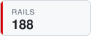
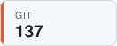

## Hi, I'm Josh 👋

## Latest TILs

<!-- TIL-START -->
- [Summarize Amount Of Change For Specific Commit](https://github.com/jbranchaud/til/blob/master/git/summarize-amount-of-change-for-specific-commit.md) `git` · 2026-09-23
- [Format Amount As Currency](https://github.com/jbranchaud/til/blob/master/rails/format-amount-as-currency.md) `rails` · 2026-09-18
- [Run Python Tools With `uvx`](https://github.com/jbranchaud/til/blob/master/python/run-python-tools-with-uvx.md) `python` · 2026-09-09
- [Use Claude Code From Multiple Accounts](https://github.com/jbranchaud/til/blob/master/claude-code/use-claude-code-from-multiple-accounts.md) `claude-code` · 2026-09-08
- [Generate Image Alt Text Across Various Claude Models](https://github.com/jbranchaud/til/blob/master/llm/generate-image-alt-text-across-claude-models.md) `llm` · 2026-09-07
<!-- TIL-END -->

I've written <!-- TIL-COUNT-START -->1,882<!-- TIL-COUNT-END --> TILs and counting, more at [jbranchaud/til](https://github.com/jbranchaud/til).

### Top TIL Topics

<!-- TIL-TOP-START -->
<a href="https://github.com/jbranchaud/til/tree/master/rails"><picture><source media="(prefers-color-scheme: dark)" srcset="assets/tiles/rails-188-dark.svg"></picture></a>
<a href="https://github.com/jbranchaud/til/tree/master/unix"><picture><source media="(prefers-color-scheme: dark)" srcset="assets/tiles/unix-186-dark.svg"></picture></a>
<a href="https://github.com/jbranchaud/til/tree/master/postgres"><picture><source media="(prefers-color-scheme: dark)" srcset="assets/tiles/postgres-175-dark.svg"></picture></a>
<a href="https://github.com/jbranchaud/til/tree/master/ruby"><picture><source media="(prefers-color-scheme: dark)" srcset="assets/tiles/ruby-172-dark.svg"></picture></a>
<a href="https://github.com/jbranchaud/til/tree/master/vim"><picture><source media="(prefers-color-scheme: dark)" srcset="assets/tiles/vim-159-dark.svg"></picture></a>
<a href="https://github.com/jbranchaud/til/tree/master/git"><picture><source media="(prefers-color-scheme: dark)" srcset="assets/tiles/git-137-dark.svg"></picture></a>
<a href="https://github.com/jbranchaud/til/tree/master/javascript"><picture><source media="(prefers-color-scheme: dark)" srcset="assets/tiles/javascript-107-dark.svg"></picture></a>
<a href="https://github.com/jbranchaud/til/tree/master/python"><picture><source media="(prefers-color-scheme: dark)" srcset="assets/tiles/python-69-dark.svg"></picture></a>
<a href="https://github.com/jbranchaud/til/tree/master/react"><picture><source media="(prefers-color-scheme: dark)" srcset="assets/tiles/react-57-dark.svg"></picture></a>
<a href="https://github.com/jbranchaud/til/tree/master/elixir"><picture><source media="(prefers-color-scheme: dark)" srcset="assets/tiles/elixir-52-dark.svg"></picture></a>
<!-- TIL-TOP-END -->

## Latest Blogmarks

<!-- BLOGMARKS-START -->
- [Coding agents make software engineering harder](https://still.visualmode.dev/blogmarks/343) 2026-09-25
- [10x the learning per feature](https://still.visualmode.dev/blogmarks/342) 2026-09-23
- [Introducing System One Models & Jev](https://still.visualmode.dev/blogmarks/341) 2026-09-23
- [Attention is all you have](https://still.visualmode.dev/blogmarks/340) 2026-09-22
- [How To Write With An LLM](https://still.visualmode.dev/blogmarks/339) 2026-09-21
<!-- BLOGMARKS-END -->

More at [still.visualmode.dev/blogmarks](https://still.visualmode.dev/blogmarks).
