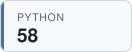

## Hi, I'm Josh 👋

## Latest TILs

<!-- TIL-START -->
- [Mark A Release With An Annotated Tag](https://github.com/jbranchaud/til/blob/master/git/mark-a-release-with-an-annotated-tag.md) `git` · 2026-08-02
- [Experiment With SQLite Queries In Memory](https://github.com/jbranchaud/til/blob/master/python/experiment-with-sqlite-queries-in-memory.md) `python` · 2026-08-01
- [Move YouTube Subtitles Out Of The Way](https://github.com/jbranchaud/til/blob/master/workflow/move-youtube-subtitles-out-of-the-way.md) `workflow` · 2026-07-31
- [Another Way To Mark Keyword-Only Dataclass Fields](https://github.com/jbranchaud/til/blob/master/python/another-way-to-mark-keyword-only-dataclass-fields.md) `python` · 2026-07-30
- [Run Scheduled Action To Commit Regular Updates](https://github.com/jbranchaud/til/blob/master/github-actions/run-scheduled-action-to-commit-regular-updates.md) `github-actions` · 2026-07-29
<!-- TIL-END -->

I've written <!-- TIL-COUNT-START -->1,849<!-- TIL-COUNT-END --> TILs and counting, more at [jbranchaud/til](https://github.com/jbranchaud/til).

### Top TIL Topics

<!-- TIL-TOP-START -->
<a href="https://github.com/jbranchaud/til/tree/master/rails"><picture><source media="(prefers-color-scheme: dark)" srcset="assets/tiles/rails-185-dark.svg"></picture></a>
<a href="https://github.com/jbranchaud/til/tree/master/unix"><picture><source media="(prefers-color-scheme: dark)" srcset="assets/tiles/unix-184-dark.svg"></picture></a>
<a href="https://github.com/jbranchaud/til/tree/master/postgres"><picture><source media="(prefers-color-scheme: dark)" srcset="assets/tiles/postgres-174-dark.svg"></picture></a>
<a href="https://github.com/jbranchaud/til/tree/master/ruby"><picture><source media="(prefers-color-scheme: dark)" srcset="assets/tiles/ruby-171-dark.svg"></picture></a>
<a href="https://github.com/jbranchaud/til/tree/master/vim"><picture><source media="(prefers-color-scheme: dark)" srcset="assets/tiles/vim-159-dark.svg"></picture></a>
<a href="https://github.com/jbranchaud/til/tree/master/git"><picture><source media="(prefers-color-scheme: dark)" srcset="assets/tiles/git-135-dark.svg"></picture></a>
<a href="https://github.com/jbranchaud/til/tree/master/javascript"><picture><source media="(prefers-color-scheme: dark)" srcset="assets/tiles/javascript-105-dark.svg"></picture></a>
<a href="https://github.com/jbranchaud/til/tree/master/python"><picture><source media="(prefers-color-scheme: dark)" srcset="assets/tiles/python-58-dark.svg"></picture></a>
<a href="https://github.com/jbranchaud/til/tree/master/react"><picture><source media="(prefers-color-scheme: dark)" srcset="assets/tiles/react-57-dark.svg"></picture></a>
<a href="https://github.com/jbranchaud/til/tree/master/elixir"><picture><source media="(prefers-color-scheme: dark)" srcset="assets/tiles/elixir-52-dark.svg"></picture></a>
<!-- TIL-TOP-END -->
