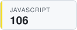
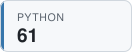

## Hi, I'm Josh 👋

## Latest TILs

<!-- TIL-START -->
- [Delete Empty Files With Find](https://github.com/jbranchaud/til/blob/master/unix/delete-empty-files-with-find.md) `unix` · 2026-08-13
- [Handle Bad Numerical Amounts With BigDecimal](https://github.com/jbranchaud/til/blob/master/rails/handle-bad-numerical-amounts-with-big-decimal.md) `rails` · 2026-08-12
- [Where And Which Are Whence](https://github.com/jbranchaud/til/blob/master/zsh/where-and-which-are-whence.md) `zsh` · 2026-08-12
- [Combine StrEnum With Pydantic For Union Type](https://github.com/jbranchaud/til/blob/master/python/combine-strenum-with-pydantic-for-union-type.md) `python` · 2026-08-10
- [Convert Arbitrary Number To Probability With Sigmoid](https://github.com/jbranchaud/til/blob/master/math/convert-arbitrary-number-to-probability-with-sigmoid.md) `math` · 2026-08-09
<!-- TIL-END -->

I've written <!-- TIL-COUNT-START -->1,861<!-- TIL-COUNT-END --> TILs and counting, more at [jbranchaud/til](https://github.com/jbranchaud/til).

### Top TIL Topics

<!-- TIL-TOP-START -->
<a href="https://github.com/jbranchaud/til/tree/master/rails"><picture><source media="(prefers-color-scheme: dark)" srcset="assets/tiles/rails-187-dark.svg"></picture></a>
<a href="https://github.com/jbranchaud/til/tree/master/unix"><picture><source media="(prefers-color-scheme: dark)" srcset="assets/tiles/unix-185-dark.svg"></picture></a>
<a href="https://github.com/jbranchaud/til/tree/master/postgres"><picture><source media="(prefers-color-scheme: dark)" srcset="assets/tiles/postgres-175-dark.svg"></picture></a>
<a href="https://github.com/jbranchaud/til/tree/master/ruby"><picture><source media="(prefers-color-scheme: dark)" srcset="assets/tiles/ruby-171-dark.svg"></picture></a>
<a href="https://github.com/jbranchaud/til/tree/master/vim"><picture><source media="(prefers-color-scheme: dark)" srcset="assets/tiles/vim-159-dark.svg"></picture></a>
<a href="https://github.com/jbranchaud/til/tree/master/git"><picture><source media="(prefers-color-scheme: dark)" srcset="assets/tiles/git-136-dark.svg"></picture></a>
<a href="https://github.com/jbranchaud/til/tree/master/javascript"><picture><source media="(prefers-color-scheme: dark)" srcset="assets/tiles/javascript-106-dark.svg"></picture></a>
<a href="https://github.com/jbranchaud/til/tree/master/python"><picture><source media="(prefers-color-scheme: dark)" srcset="assets/tiles/python-61-dark.svg"></picture></a>
<a href="https://github.com/jbranchaud/til/tree/master/react"><picture><source media="(prefers-color-scheme: dark)" srcset="assets/tiles/react-57-dark.svg"></picture></a>
<a href="https://github.com/jbranchaud/til/tree/master/elixir"><picture><source media="(prefers-color-scheme: dark)" srcset="assets/tiles/elixir-52-dark.svg"></picture></a>
<!-- TIL-TOP-END -->
