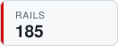
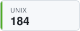
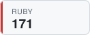
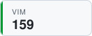
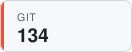
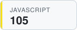
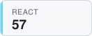
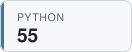
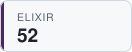

## Hi, I'm Josh 👋

## Latest TILs

<!-- TIL-START -->
- [Start Jupyter Notebook With Extra Packages](https://github.com/jbranchaud/til/blob/master/python/start-jupyter-notebook-with-extra-packages.md) `python` · 2026-07-27
- [Include A File With Message To `ant`](https://github.com/jbranchaud/til/blob/master/llm/include-a-file-with-message-to-ant.md) `llm` · 2026-07-27
- [Configure Other Attributes Of Dataclass Field](https://github.com/jbranchaud/til/blob/master/python/configure-other-attributes-of-dataclass-field.md) `python` · 2026-07-26
- [Jump From Section To Section](https://github.com/jbranchaud/til/blob/master/zed/jump-from-section-to-section.md) `zed` · 2026-07-26
- [Try Out The Latest Version Of Ruff](https://github.com/jbranchaud/til/blob/master/python/try-out-the-latest-version-of-ruff.md) `python` · 2026-07-25
<!-- TIL-END -->

I've written <!-- TIL-COUNT-START -->1,842<!-- TIL-COUNT-END --> TILs and counting, more at [jbranchaud/til](https://github.com/jbranchaud/til).

### Top TIL Topics

<!-- TIL-TOP-START -->
<a href="https://github.com/jbranchaud/til/tree/master/rails"><picture><source media="(prefers-color-scheme: dark)" srcset="assets/tiles/rails-185-dark.svg"></picture></a>
<a href="https://github.com/jbranchaud/til/tree/master/unix"><picture><source media="(prefers-color-scheme: dark)" srcset="assets/tiles/unix-184-dark.svg"></picture></a>
<a href="https://github.com/jbranchaud/til/tree/master/postgres"><picture><source media="(prefers-color-scheme: dark)" srcset="assets/tiles/postgres-174-dark.svg"></picture></a>
<a href="https://github.com/jbranchaud/til/tree/master/ruby"><picture><source media="(prefers-color-scheme: dark)" srcset="assets/tiles/ruby-171-dark.svg"></picture></a>
<a href="https://github.com/jbranchaud/til/tree/master/vim"><picture><source media="(prefers-color-scheme: dark)" srcset="assets/tiles/vim-159-dark.svg"></picture></a>
<a href="https://github.com/jbranchaud/til/tree/master/git"><picture><source media="(prefers-color-scheme: dark)" srcset="assets/tiles/git-134-dark.svg"></picture></a>
<a href="https://github.com/jbranchaud/til/tree/master/javascript"><picture><source media="(prefers-color-scheme: dark)" srcset="assets/tiles/javascript-105-dark.svg"></picture></a>
<a href="https://github.com/jbranchaud/til/tree/master/react"><picture><source media="(prefers-color-scheme: dark)" srcset="assets/tiles/react-57-dark.svg"></picture></a>
<a href="https://github.com/jbranchaud/til/tree/master/python"><picture><source media="(prefers-color-scheme: dark)" srcset="assets/tiles/python-55-dark.svg"></picture></a>
<a href="https://github.com/jbranchaud/til/tree/master/elixir"><picture><source media="(prefers-color-scheme: dark)" srcset="assets/tiles/elixir-52-dark.svg"></picture></a>
<!-- TIL-TOP-END -->
