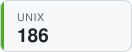
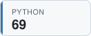

## Hi, I'm Josh 👋

## Latest TILs

<!-- TIL-START -->
- [Run Python Tools With `uvx`](https://github.com/jbranchaud/til/blob/master/python/run-python-tools-with-uvx.md) `python` · 2026-09-09
- [Use Claude Code From Multiple Accounts](https://github.com/jbranchaud/til/blob/master/claude-code/use-claude-code-from-multiple-accounts.md) `claude-code` · 2026-09-08
- [Generate Image Alt Text Across Various Claude Models](https://github.com/jbranchaud/til/blob/master/llm/generate-image-alt-text-across-claude-models.md) `llm` · 2026-09-07
- [Connect To Individual Overmind Processes Via tmux](https://github.com/jbranchaud/til/blob/master/tmux/connect-to-individual-overmind-processes-via-tmux.md) `tmux` · 2026-08-30
- [Output Query Result In Nicely Formatted Table](https://github.com/jbranchaud/til/blob/master/sqlite/output-query-result-in-nicely-formatted-table.md) `sqlite` · 2026-08-29
<!-- TIL-END -->

I've written <!-- TIL-COUNT-START -->1,880<!-- TIL-COUNT-END --> TILs and counting, more at [jbranchaud/til](https://github.com/jbranchaud/til).

### Top TIL Topics

<!-- TIL-TOP-START -->
<a href="https://github.com/jbranchaud/til/tree/master/rails"><picture><source media="(prefers-color-scheme: dark)" srcset="assets/tiles/rails-187-dark.svg"></picture></a>
<a href="https://github.com/jbranchaud/til/tree/master/unix"><picture><source media="(prefers-color-scheme: dark)" srcset="assets/tiles/unix-186-dark.svg"></picture></a>
<a href="https://github.com/jbranchaud/til/tree/master/postgres"><picture><source media="(prefers-color-scheme: dark)" srcset="assets/tiles/postgres-175-dark.svg"></picture></a>
<a href="https://github.com/jbranchaud/til/tree/master/ruby"><picture><source media="(prefers-color-scheme: dark)" srcset="assets/tiles/ruby-172-dark.svg"></picture></a>
<a href="https://github.com/jbranchaud/til/tree/master/vim"><picture><source media="(prefers-color-scheme: dark)" srcset="assets/tiles/vim-159-dark.svg"></picture></a>
<a href="https://github.com/jbranchaud/til/tree/master/git"><picture><source media="(prefers-color-scheme: dark)" srcset="assets/tiles/git-136-dark.svg"></picture></a>
<a href="https://github.com/jbranchaud/til/tree/master/javascript"><picture><source media="(prefers-color-scheme: dark)" srcset="assets/tiles/javascript-107-dark.svg"></picture></a>
<a href="https://github.com/jbranchaud/til/tree/master/python"><picture><source media="(prefers-color-scheme: dark)" srcset="assets/tiles/python-69-dark.svg"></picture></a>
<a href="https://github.com/jbranchaud/til/tree/master/react"><picture><source media="(prefers-color-scheme: dark)" srcset="assets/tiles/react-57-dark.svg"></picture></a>
<a href="https://github.com/jbranchaud/til/tree/master/elixir"><picture><source media="(prefers-color-scheme: dark)" srcset="assets/tiles/elixir-52-dark.svg"></picture></a>
<!-- TIL-TOP-END -->
