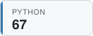

## Hi, I'm Josh 👋

## Latest TILs

<!-- TIL-START -->
- [Specify Parameter Name For Click Option](https://github.com/jbranchaud/til/blob/master/python/specify-parameter-name-for-click-option.md) `python` · 2026-08-23
- [Check What Is Inside A Zip File](https://github.com/jbranchaud/til/blob/master/unix/check-what-is-inside-a-zip-file.md) `unix` · 2026-08-22
- [Generate Sample PDFs With ReportLab](https://github.com/jbranchaud/til/blob/master/python/generate-sample-pdfs-with-reportlab.md) `python` · 2026-08-21
- [Remove Pages From A PDF](https://github.com/jbranchaud/til/blob/master/workflow/remove-pages-from-a-pdf.md) `workflow` · 2026-08-19
- [Escape Curly Braces Within Formatted String](https://github.com/jbranchaud/til/blob/master/python/escape-curly-braces-within-formatted-string.md) `python` · 2026-08-19
<!-- TIL-END -->

I've written <!-- TIL-COUNT-START -->1,872<!-- TIL-COUNT-END --> TILs and counting, more at [jbranchaud/til](https://github.com/jbranchaud/til).

### Top TIL Topics

<!-- TIL-TOP-START -->
<a href="https://github.com/jbranchaud/til/tree/master/rails"><picture><source media="(prefers-color-scheme: dark)" srcset="assets/tiles/rails-187-dark.svg"></picture></a>
<a href="https://github.com/jbranchaud/til/tree/master/unix"><picture><source media="(prefers-color-scheme: dark)" srcset="assets/tiles/unix-186-dark.svg"></picture></a>
<a href="https://github.com/jbranchaud/til/tree/master/postgres"><picture><source media="(prefers-color-scheme: dark)" srcset="assets/tiles/postgres-175-dark.svg"></picture></a>
<a href="https://github.com/jbranchaud/til/tree/master/ruby"><picture><source media="(prefers-color-scheme: dark)" srcset="assets/tiles/ruby-172-dark.svg"></picture></a>
<a href="https://github.com/jbranchaud/til/tree/master/vim"><picture><source media="(prefers-color-scheme: dark)" srcset="assets/tiles/vim-159-dark.svg"></picture></a>
<a href="https://github.com/jbranchaud/til/tree/master/git"><picture><source media="(prefers-color-scheme: dark)" srcset="assets/tiles/git-136-dark.svg"></picture></a>
<a href="https://github.com/jbranchaud/til/tree/master/javascript"><picture><source media="(prefers-color-scheme: dark)" srcset="assets/tiles/javascript-107-dark.svg"></picture></a>
<a href="https://github.com/jbranchaud/til/tree/master/python"><picture><source media="(prefers-color-scheme: dark)" srcset="assets/tiles/python-67-dark.svg"></picture></a>
<a href="https://github.com/jbranchaud/til/tree/master/react"><picture><source media="(prefers-color-scheme: dark)" srcset="assets/tiles/react-57-dark.svg"></picture></a>
<a href="https://github.com/jbranchaud/til/tree/master/elixir"><picture><source media="(prefers-color-scheme: dark)" srcset="assets/tiles/elixir-52-dark.svg"></picture></a>
<!-- TIL-TOP-END -->
