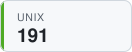
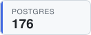
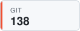
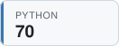

## Hi, I'm Josh 👋

## Latest TILs

<!-- TIL-START -->
- [Toggle Through TODO Statuses On Current Block](https://github.com/jbranchaud/til/blob/master/logseq/toggle-through-todo-statuses-on-current-block.md) `logseq` · 2026-11-25
- [Generate Simple SVG Diagram With D2 Lang](https://github.com/jbranchaud/til/blob/master/workflow/generate-simple-svg-diagram-with-d2-lang.md) `workflow` · 2026-11-24
- [Eject A Device So It Can Be Unplugged](https://github.com/jbranchaud/til/blob/master/mac/eject-a-device-so-it-can-be-unplugged.md) `mac` · 2026-11-24
- [Run Specific Scheduled Workflow Early](https://github.com/jbranchaud/til/blob/master/github-actions/run-specific-scheduled-workflow-early.md) `github-actions` · 2026-11-22
- [Connect To Hatchbox Rails Console](https://github.com/jbranchaud/til/blob/master/devops/connect-to-hatchbox-rails-console.md) `devops` · 2026-11-22
<!-- TIL-END -->

I've written <!-- TIL-COUNT-START -->1,917<!-- TIL-COUNT-END --> TILs and counting, more at [jbranchaud/til](https://github.com/jbranchaud/til).

### Top TIL Topics

<!-- TIL-TOP-START -->
<a href="https://github.com/jbranchaud/til/tree/master/unix"><picture><source media="(prefers-color-scheme: dark)" srcset="assets/tiles/unix-191-dark.svg"></picture></a>
<a href="https://github.com/jbranchaud/til/tree/master/rails"><picture><source media="(prefers-color-scheme: dark)" srcset="assets/tiles/rails-189-dark.svg"></picture></a>
<a href="https://github.com/jbranchaud/til/tree/master/postgres"><picture><source media="(prefers-color-scheme: dark)" srcset="assets/tiles/postgres-176-dark.svg"></picture></a>
<a href="https://github.com/jbranchaud/til/tree/master/ruby"><picture><source media="(prefers-color-scheme: dark)" srcset="assets/tiles/ruby-173-dark.svg"></picture></a>
<a href="https://github.com/jbranchaud/til/tree/master/vim"><picture><source media="(prefers-color-scheme: dark)" srcset="assets/tiles/vim-159-dark.svg"></picture></a>
<a href="https://github.com/jbranchaud/til/tree/master/git"><picture><source media="(prefers-color-scheme: dark)" srcset="assets/tiles/git-138-dark.svg"></picture></a>
<a href="https://github.com/jbranchaud/til/tree/master/javascript"><picture><source media="(prefers-color-scheme: dark)" srcset="assets/tiles/javascript-107-dark.svg"></picture></a>
<a href="https://github.com/jbranchaud/til/tree/master/python"><picture><source media="(prefers-color-scheme: dark)" srcset="assets/tiles/python-70-dark.svg"></picture></a>
<a href="https://github.com/jbranchaud/til/tree/master/react"><picture><source media="(prefers-color-scheme: dark)" srcset="assets/tiles/react-57-dark.svg"></picture></a>
<a href="https://github.com/jbranchaud/til/tree/master/elixir"><picture><source media="(prefers-color-scheme: dark)" srcset="assets/tiles/elixir-52-dark.svg"></picture></a>
<!-- TIL-TOP-END -->

## Latest Blogmarks

<!-- BLOGMARKS-START -->
- [Introducing Vercel Board](https://still.visualmode.dev/blogmarks/366) `vercel` `ai-assisted-coding` · 2026-11-25
- [Claude Code Status Line](https://still.visualmode.dev/blogmarks/365) `claude-code` `cli` · 2026-11-18
- [Keep Learning](https://still.visualmode.dev/blogmarks/364) `ai-assisted-coding` `learning` · 2026-11-12
- [Building "Recipe Box" with Lovable](https://still.visualmode.dev/blogmarks/363) `ai-assisted-coding` `lovable` · 2026-11-09
- [Render this year's calendar in the browser](https://still.visualmode.dev/blogmarks/362) `python` `calendar` · 2026-11-05
<!-- BLOGMARKS-END -->

More at [still.visualmode.dev/blogmarks](https://still.visualmode.dev/blogmarks).
